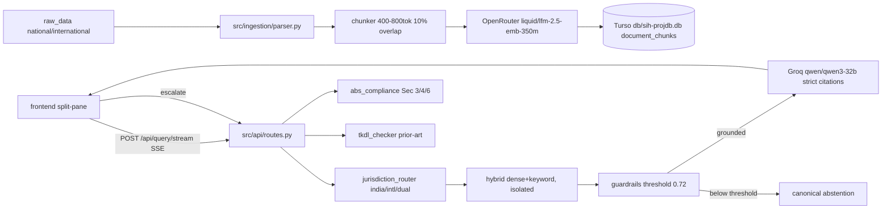

# Architecture — IP-SAKTI Sahayak (SIH 26045)

## Overview
Perplexity-style split-jurisdiction RAG over a curated Indian + International IP corpus.
FastAPI backend (async, SSE) · SQLite/Turso vector store (JSON embeddings, brute-force
cosine partitioned by jurisdiction) · Groq Qwen generation · OpenRouter embeddings ·
Obsidian dark frontend.

## Components
| Component | File | Spec |
|---|---|---|
| PDF parser | `src/ingestion/parser.py` | pypdf, section-header split, metadata jurisdiction/source/doc_type/section_id |
| Chunker | `src/ingestion/chunker.py` | clause-aware, 400–800 tok, 10% overlap, min 40 tok |
| Embedder | `src/ingestion/embedder.py` | OpenRouter async, batch 32, 5× exp backoff, offline hash fallback 384-d |
| Vector store | `src/core/vector_store.py` | SQLite/libsql, `document_chunks`, `queries_audit`, `escalations`; cosine mapped to [0,1], jurisdiction-partitioned |
| Retriever | `src/core/retriever.py` | hybrid 0.8 dense + 0.2 keyword, dual = two isolated searches |
| Guardrails | `src/core/guardrails.py` | abstain if max < 0.72; confidence = .45 top + .25 mean3 + .15 density + .15 overlap; PII scrub; citation payload |
| Generator | `src/core/generator.py` | Groq OpenAI-compat, alias qwen3.8-27b→qwen3-32b + fallbacks, forced `[^N]` citations, offline extractive fallback |
| Jurisdiction router | `src/services/jurisdiction_router.py` | honors UI toggle; auto-detect on keywords |
| ABS | `src/services/abs_compliance.py` | BD Act Sec 3/4/6/7, NBA Chennai, risk tier |
| TKDL | `src/services/tkdl_checker.py` | 16-term Ayurveda/Unani/Siddha heuristic + Sec 3(p) novelty caution |
| API | `src/api/{main,routes,schemas}.py` | `/query`, `/query/stream` SSE, `/ingest`, `/models`, `/escalate`, `/health`; CORS * (restrict in prod) |

## Model routing & costs
- LLM: Groq `qwen/qwen3.8-27b` (verified live; fallbacks `qwen/qwen3.6-27b`,
  `openai/gpt-oss-20b`), temp 0.1, max 1000 tokens (free-tier OTPM cap).
  Per-query ~1–2k tokens total. Qwen thinking traces stripped (`/no_think` + post-filter).
- Embeddings: OpenRouter `openai/text-embedding-3-small` with native
  `dimensions: 384` (free fallback `liquid/lfm-2.5-embedding-350m:free`, 512-token
  cap — embedder sub-splits + mean-pools for it). Calibrated gate: relevant 0.81+,
  unrelated ~0.53, threshold 0.65.
- Embeddings: OpenRouter `openai/text-embedding-3-small` (native 384-d, ~4.5k chunks
  ingested). Offline hash embeddings + extractive answers keep demo/test fully local.

## DPDP compliance
Disclaimer header on every answer; audit log without PII; escalation contact minimal + consented; no cross-user leakage; no training on queries.
